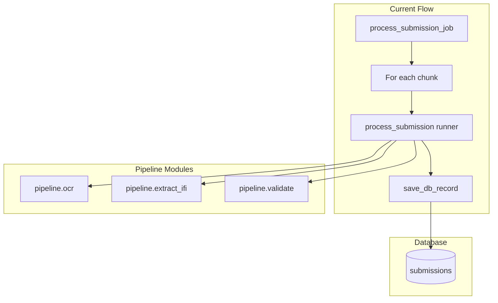
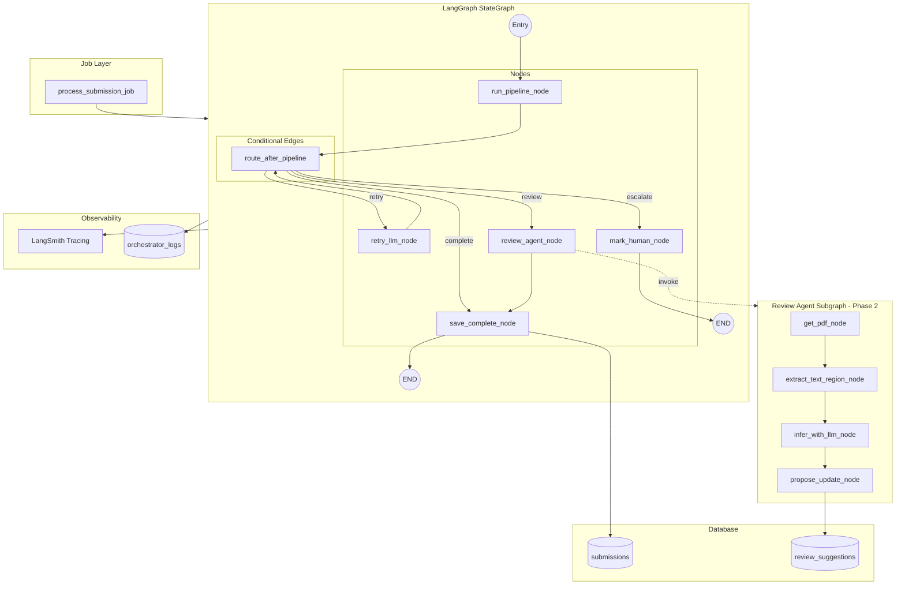

# Supervisor Agent (Orchestrator) Build Plan — LangGraph Edition

## Dependencies

```bash
pip install langchain langgraph langsmith
```


| Package   | Version | Purpose                                      |
| --------- | ------- | -------------------------------------------- |
| langchain | >=0.3.0 | Tool abstractions, base types                |
| langgraph | >=0.2.0 | StateGraph, checkpointing, conditional edges |
| langsmith | >=0.1.0 | Tracing, debugging, replay                   |


**Existing stack (unchanged):** Groq, Supabase, PyMuPDF, Flask, existing `pipeline/*` modules.

**Python:** 3.10+

---

## LangSmith Setup

Add to `.env` (optional; tracing disabled when unset):

```
LANGCHAIN_TRACING_V2=true
LANGCHAIN_API_KEY=lsv2_pt_...
LANGCHAIN_PROJECT=IFI-Orchestrator
LANGCHAIN_ENDPOINT=https://api.smith.langchain.com
```

- **Tracing:** All graph node executions are auto-traced.
- **Replay:** Use LangSmith UI to replay runs for debugging.
- **Fallback:** When `LANGCHAIN_TRACING_V2` is false, graph runs normally without traces.

---

## Current Architecture (Integration Points)




**Key existing pieces:**

- `[jobs/process_submission.py](IFI Essay tool/jobs/process_submission.py)`: Loops over chunks, calls `process_submission()`, saves each record. Each chunk = one submission.
- `[pipeline/runner.py](IFI Essay tool/pipeline/runner.py)`: `process_submission()` returns `(SubmissionRecord, report)` with `needs_review`, `ocr_confidence_avg`, `extraction_debug`, `review_reason_codes`.
- `[pipeline/validate.py](IFI Essay tool/pipeline/validate.py)`: `can_approve_record()`, `validate_record()` — drives `needs_review` and missing-field logic.
- `[pipeline/extract_ifi.py](IFI Essay tool/pipeline/extract_ifi.py)`: LLM (Groq) extraction, typed-form rules, freeform heuristics; `extract_fields_ifi()` and `extract_ifi_submission()`.
- `[pipeline/supabase_db.py](IFI Essay tool/pipeline/supabase_db.py)`: `save_record`, `update_record`, `get_record_by_id`.
- Supabase: `submissions` table with `needs_review`, `review_reason_codes`, `ocr_confidence_avg`.

---

## Phase 1: Core Orchestrator (Week 1-2)

### 1.1 State Schema (TypedDict)

**New file:** `pipeline/orchestrator_state.py`

```python
from typing import TypedDict, List, Optional, Literal, Any

# Use dict for record to support JSON serialization in checkpointing
class AgentState(TypedDict, total=False):
    submission_id: str
    record: Optional[Any]  # SubmissionRecord as dict for checkpointing
    report: Optional[dict]
    tries: int
    tools_used: List[str]
    status: str  # "processing" | "retry" | "review" | "escalate" | "completed" | "failed"
    missing_fields: List[str]
    confidence: float
    needs_review: bool
    max_steps: int
    # Job context (passed in, not modified by graph)
    image_path: str
    artifact_dir: str
    ocr_provider_name: str
    original_filename: Optional[str]
    chunk_metadata: Optional[dict]
    doc_format: Optional[str]
    owner_user_id: str
    access_token: Optional[str]
    upload_batch_id: Optional[str]
```

**Confidence derivation** (helper in `orchestrator_nodes.py`):

- `ocr_confidence_avg` (0–1) from `report["ocr_summary"]["confidence_avg"]` or `record.ocr_confidence_avg`
- Weight: 0.6 OCR + 0.4 field completeness (1.0 if all required fields present, else proportional)
- Default 0.5 when OCR confidence is `None` (typed PDFs)

### 1.2 Node Functions

**New file:** `pipeline/orchestrator_nodes.py`

Each tool becomes a **node** that takes `AgentState` and returns partial state updates:

```python
def run_pipeline_node(state: AgentState) -> dict:
    from pipeline.runner import process_submission

    record, report = process_submission(
        image_path=state["image_path"],
        submission_id=state["submission_id"],
        artifact_dir=state["artifact_dir"],
        ocr_provider_name=state.get("ocr_provider_name", "stub"),
        original_filename=state.get("original_filename"),
        chunk_metadata=state.get("chunk_metadata"),
        doc_format=state.get("doc_format"),
    )

    record_dict = record.model_dump() if hasattr(record, "model_dump") else record.dict()
    confidence = _calculate_confidence(record, report)
    can_approve, missing = can_approve_record(record_dict)

    return {
        "record": record_dict,
        "report": report,
        "tries": state.get("tries", 0) + 1,
        "tools_used": state.get("tools_used", []) + ["run_pipeline"],
        "confidence": confidence,
        "needs_review": record.needs_review if record else True,
        "missing_fields": missing,
        "status": "processing",
    }
```

```python
def retry_llm_node(state: AgentState) -> dict:
    from pipeline.extract_ifi import extract_missing_fields_only
    from pipeline.validate import validate_record

    raw_text = state["report"].get("raw_text") or _load_raw_text(state)
    updates = extract_missing_fields_only(raw_text, state["missing_fields"])

    record = {**state["record"], **updates}
    partial = {**record, "submission_id": state["submission_id"], "artifact_dir": state["artifact_dir"], ...}
    new_record, _ = validate_record(partial)

    return {
        "record": new_record.model_dump(),
        "tries": state["tries"] + 1,
        "tools_used": state["tools_used"] + ["retry_with_llm"],
        "confidence": _calculate_confidence(new_record, state["report"]),
        "needs_review": new_record.needs_review,
        "missing_fields": [...],  # from can_approve_record
    }
```

```python
def save_complete_node(state: AgentState) -> dict:
    return {"status": "completed", "final_outcome": "completed"}
```

```python
def mark_human_node(state: AgentState) -> dict:
    return {"status": "escalate", "final_outcome": "escalated"}
```

### 1.3 Routing Functions

**New file:** `pipeline/orchestrator_routing.py`

```python
def route_after_pipeline(state: AgentState) -> str:
    if len(state.get("tools_used", [])) >= state.get("max_steps", 5):
        return "escalate"
    can_approve = state.get("missing_fields", []) == []
    if can_approve and state.get("confidence", 0) >= 0.9:
        return "complete"
    if state.get("confidence", 0) < 0.5 and state.get("tries", 0) < 2 and state.get("missing_fields"):
        return "retry"
    if state.get("needs_review") and state.get("tries", 0) < 3:
        return "review"
    return "escalate"
```

### 1.4 Graph Definition

**New file:** `pipeline/orchestrator_graph.py`

```python
from langgraph.graph import StateGraph, END
from langgraph.checkpoint.memory import MemorySaver

from pipeline.orchestrator_state import AgentState
from pipeline.orchestrator_nodes import (
    run_pipeline_node,
    retry_llm_node,
    review_agent_node,  # Phase 2: subgraph
    save_complete_node,
    mark_human_node,
)
from pipeline.orchestrator_routing import route_after_pipeline

def create_orchestrator_graph(checkpointer=None):
    workflow = StateGraph(AgentState)

    workflow.add_node("run_pipeline", run_pipeline_node)
    workflow.add_node("retry_with_llm", retry_llm_node)
    workflow.add_node("review_agent", review_agent_node)  # Phase 2
    workflow.add_node("save_complete", save_complete_node)
    workflow.add_node("mark_for_human", mark_human_node)

    workflow.set_entry_point("run_pipeline")

    workflow.add_conditional_edges(
        "run_pipeline",
        route_after_pipeline,
        {
            "retry": "retry_with_llm",
            "review": "review_agent",
            "complete": "save_complete",
            "escalate": "mark_for_human",
        },
    )

    workflow.add_conditional_edges(
        "retry_with_llm",
        route_after_pipeline,
        {
            "retry": "retry_with_llm",
            "review": "review_agent",
            "complete": "save_complete",
            "escalate": "mark_for_human",
        },
    )

    workflow.add_edge("review_agent", "save_complete")
    workflow.add_edge("save_complete", END)
    workflow.add_edge("mark_for_human", END)

    memory = checkpointer or MemorySaver()
    return workflow.compile(checkpointer=memory)
```

### 1.5 Integration Point

**Modify:** `[jobs/process_submission.py](IFI Essay tool/jobs/process_submission.py)`

```python
USE_ORCHESTRATOR = os.getenv("USE_ORCHESTRATOR", "true").lower() == "true"

if USE_ORCHESTRATOR:
    from pipeline.orchestrator_graph import create_orchestrator_graph

    graph = create_orchestrator_graph()
    initial_state: AgentState = {
        "submission_id": chunk_submission_id,
        "image_path": chunk_path,
        "artifact_dir": chunk_artifact_dir,
        "ocr_provider_name": ocr_provider,
        "original_filename": filename,
        "chunk_metadata": {...},
        "doc_format": analysis.format,
        "owner_user_id": owner_user_id,
        "access_token": storage_token,
        "upload_batch_id": upload_batch_id,
        "tries": 0,
        "tools_used": [],
        "max_steps": 5,
    }
    result = graph.invoke(initial_state)
    record = SubmissionRecord(**result["record"])
    report = result["report"]
else:
    record, report = process_submission(...)
```

The job continues to call `save_db_record(record, ...)` after the block; the graph returns the final `record` and `report` in the same shape.

### 1.6 LangChain Tools (Optional)

For nodes that delegate to LangChain tools:

```python
from langchain_core.tools import tool

@tool
def retry_with_llm_tool(raw_text: str, missing_fields: List[str]) -> dict:
    """Extract only the missing fields from OCR text using Groq."""
    from pipeline.extract_ifi import extract_missing_fields_only
    return extract_missing_fields_only(raw_text, missing_fields)
```

Nodes can invoke tools via `tool.invoke(...)`; LangSmith will trace tool calls.

### 1.7 Database Migration for Orchestrator Logs

**New migration:** `supabase/migrations/007_create_orchestrator_logs.sql`

```sql
CREATE TABLE IF NOT EXISTS orchestrator_logs (
  id UUID PRIMARY KEY DEFAULT gen_random_uuid(),
  submission_id TEXT NOT NULL,
  timestamp TIMESTAMPTZ DEFAULT now(),
  state_json JSONB,
  action_taken TEXT NOT NULL,
  reason TEXT,
  tools_used TEXT[],
  final_outcome TEXT,
  trace_json JSONB,
  owner_user_id TEXT
);
CREATE INDEX idx_orchestrator_logs_submission ON orchestrator_logs(submission_id);
CREATE INDEX idx_orchestrator_logs_timestamp ON orchestrator_logs(timestamp DESC);
```

### 1.8 Extract Missing Fields Helper

**Modify:** `[pipeline/extract_ifi.py](IFI Essay tool/pipeline/extract_ifi.py)`

Add:

```python
def extract_missing_fields_only(raw_text: str, missing_fields: List[str]) -> dict:
    """Groq call to extract only specified fields from OCR text."""
    # Build prompt; call Groq; return {field: value} for fields in missing_fields
```

### 1.9 Files to Create/Modify (Phase 1)


| Action | Path                                                                              |
| ------ | --------------------------------------------------------------------------------- |
| Create | `pipeline/orchestrator_state.py`                                                  |
| Create | `pipeline/orchestrator_nodes.py`                                                  |
| Create | `pipeline/orchestrator_routing.py`                                                |
| Create | `pipeline/orchestrator_graph.py`                                                  |
| Create | `supabase/migrations/007_create_orchestrator_logs.sql`                            |
| Modify | `jobs/process_submission.py` — call `graph.invoke()` when `USE_ORCHESTRATOR=true` |
| Modify | `pipeline/extract_ifi.py` — add `extract_missing_fields_only()`                   |


**Removed:** ~~`orchestrator_tools.py`~~, ~~`orchestrator.py`~~ (replaced by nodes + graph)

---

## Phase 2: Review Agent Integration (Week 3)

### 2.1 Review Agent as LangGraph Subgraph

**New file:** `pipeline/review_agent_graph.py`

```python
from langgraph.graph import StateGraph, END
from typing import TypedDict, List, Optional

class ReviewAgentState(TypedDict):
    submission_id: str
    record: dict
    missing_fields: List[str]
    proposed_updates: dict
    success: bool
    artifact_dir: str
    owner_user_id: str
    access_token: Optional[str]

def get_pdf_node(state: ReviewAgentState) -> dict:
    # Fetch PDF from Supabase; store path/bytes in state
    ...

def extract_text_region_node(state: ReviewAgentState) -> dict:
    # ocr_pdf_pages or extract_pdf_text_layer; page-level for Phase 2
    ...

def infer_with_llm_node(state: ReviewAgentState) -> dict:
    # Groq to extract missing fields from text
    ...

def propose_update_node(state: ReviewAgentState) -> dict:
    # Write to review_suggestions; return success
    ...

def create_review_agent_graph():
    graph = StateGraph(ReviewAgentState)
    graph.add_node("get_pdf", get_pdf_node)
    graph.add_node("extract_text", extract_text_region_node)
    graph.add_node("infer_llm", infer_with_llm_node)
    graph.add_node("propose_update", propose_update_node)
    graph.set_entry_point("get_pdf")
    graph.add_edge("get_pdf", "extract_text")
    graph.add_edge("extract_text", "infer_llm")
    graph.add_edge("infer_llm", "propose_update")
    graph.add_edge("propose_update", END)
    return graph.compile()
```

### 2.2 Orchestrator Review Agent Node

**In** `pipeline/orchestrator_nodes.py`:

```python
def review_agent_node(state: AgentState) -> dict:
    from pipeline.review_agent_graph import create_review_agent_graph

    ra_graph = create_review_agent_graph()
    ra_state = {
        "submission_id": state["submission_id"],
        "record": state["record"],
        "missing_fields": state["missing_fields"],
        "artifact_dir": state["artifact_dir"],
        "owner_user_id": state["owner_user_id"],
        "access_token": state.get("access_token"),
    }
    result = ra_graph.invoke(ra_state)
    if result.get("success"):
        return {"record": {**state["record"], **result["proposed_updates"]}, "needs_review": False}
    return {"needs_review": True}
```

### 2.3 Human-in-the-Loop Pattern

LangGraph supports `interrupt_before` / `interrupt_after` for human approval:

```python
app = workflow.compile(checkpointer=memory, interrupt_before=["mark_for_human"])
```

When `interrupt_before=["mark_for_human"]`, the graph pauses before marking for human; resume via `app.invoke(None, config={"thread_id": "..."})` after a human decision.

### 2.4 review_suggestions Table

**New migration:** `008_create_review_suggestions.sql`

```sql
CREATE TABLE IF NOT EXISTS review_suggestions (
  id UUID PRIMARY KEY DEFAULT gen_random_uuid(),
  submission_id TEXT NOT NULL,
  proposed_updates JSONB NOT NULL,
  status TEXT DEFAULT 'pending',
  created_at TIMESTAMPTZ DEFAULT now(),
  resolved_at TIMESTAMPTZ,
  resolved_by_user_id TEXT
);
```

### 2.5 Human Approval UI

Same as original plan:

- Route: `/review/suggestions`
- Table: submission_id, current values, proposed values, Approve / Reject
- On Approve: apply updates, set `needs_review=False` if `can_approve_record`, update status
- On Reject: set status to `rejected`

### 2.6 Files to Create/Modify (Phase 2)


| Action        | Path                                                                |
| ------------- | ------------------------------------------------------------------- |
| Create        | `pipeline/review_agent_graph.py`                                    |
| Create        | `supabase/migrations/008_create_review_suggestions.sql`             |
| Modify        | `pipeline/orchestrator_nodes.py` — implement `review_agent_node`    |
| Modify        | `pipeline/orchestrator_graph.py` — wire review_agent node and edges |
| Modify        | `flask_app.py` — suggestions route, apply updates                   |
| Create/Modify | Template for suggestions list or embed in record_detail             |


---

## Phase 3: Observability Layer (Week 4)

### 3.1 LangSmith Integration

- Set `LANGCHAIN_TRACING_V2=true`, `LANGCHAIN_API_KEY`, `LANGCHAIN_PROJECT=IFI-Orchestrator`.
- All nodes and tool calls are traced automatically.
- Use LangSmith UI for: trace inspection, replay, latency analysis.

### 3.2 Dual Observability


| Layer             | Purpose                             | Storage         |
| ----------------- | ----------------------------------- | --------------- |
| LangSmith         | Technical traces, debugging, replay | LangSmith cloud |
| orchestrator_logs | Business metrics, dashboard, audit  | Supabase        |


### 3.3 Custom Callback for orchestrator_logs

**Create:** `pipeline/orchestrator_db.py`

```python
def log_orchestrator_step(submission_id: str, state: dict, action: str, reason: str, final_outcome: Optional[str], owner_user_id: str):
    # Insert into orchestrator_logs
```

**In nodes:** Call `log_orchestrator_step` after each significant transition. Or use a LangChain callback handler:

```python
class OrchestratorLoggingHandler(BaseCallbackHandler):
    def on_chain_end(self, outputs, **kwargs):
        # Extract state from outputs; call log_orchestrator_step
        ...
```

Pass handler to `graph.invoke(initial_state, config={"callbacks": [OrchestratorLoggingHandler()]})`.

### 3.4 Checkpointing for State Persistence

```python
from langgraph.checkpoint.postgres import PostgresSaver

checkpointer = PostgresSaver.from_conn_string(os.getenv("DATABASE_URL"))
graph = create_orchestrator_graph(checkpointer=checkpointer)
```

Enables: resume after interrupt, inspect state at any step, replay from a given checkpoint.

### 3.5 Dashboard

- Route: `/admin/orchestrator_stats`
- Query `orchestrator_logs`: `final_outcome`, counts, avg tools per submission, top escalation reasons.
- Optional: link to LangSmith trace ID for drill-down.

### 3.6 Files to Create/Modify (Phase 3)


| Action   | Path                                                                     |
| -------- | ------------------------------------------------------------------------ |
| Create   | `pipeline/orchestrator_db.py`                                            |
| Modify   | `pipeline/orchestrator_nodes.py` — call `log_orchestrator_step` in nodes |
| Create   | `pipeline/orchestrator_callbacks.py` — custom callback for logs          |
| Modify   | `007_create_orchestrator_logs.sql` — ensure `trace_json` JSONB           |
| Create   | Flask route + template for orchestrator stats                            |
| Optional | Add Postgres checkpointer for production                                 |


---

## Architecture Diagram (LangGraph Target State)




---

## Testing Strategy

1. **Unit tests:** Test each node in isolation with mock state.
2. **Graph execution:** `graph.invoke(initial_state)` with fixtures; assert final `record` and `final_outcome`.
3. **LangSmith replay:** Run a failed trace in LangSmith; fix; replay to verify.
4. **Regression harness:** Run `scripts/regression_check.py` with `USE_ORCHESTRATOR=true` and `false`; compare extraction quality.
5. **Checkpointing:** Test `interrupt_before`, resume with `graph.invoke(None, config={"thread_id": "..."})`.

---

## Risk Mitigation

- **Backward compatibility:** Graph returns same `(record, report)` shape; job downstream logic unchanged.
- **Feature flag:** `USE_ORCHESTRATOR` env var toggles graph vs direct `process_submission`.
- **Regression:** Unit tests + regression harness with orchestrator on/off.
- **LangSmith cost:** Disable tracing in production if needed; `orchestrator_logs` remains primary audit source.

---

## Summary of New Dependencies


| Package   | Purpose                                      |
| --------- | -------------------------------------------- |
| langchain | Tool abstractions, base types                |
| langgraph | StateGraph, checkpointing, conditional edges |
| langsmith | Tracing, debugging, replay                   |


**Existing:** Groq, Supabase, PyMuPDF, Flask, `pipeline/*`.